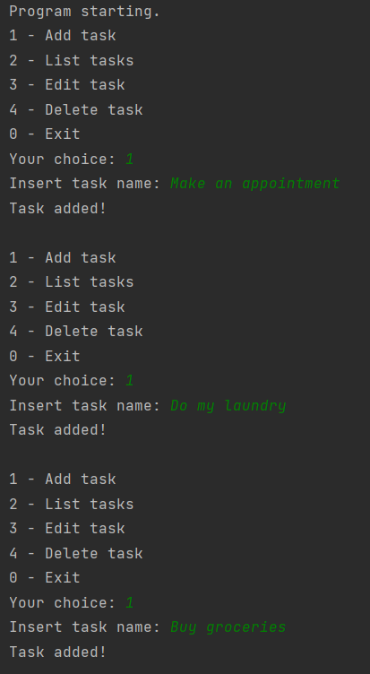
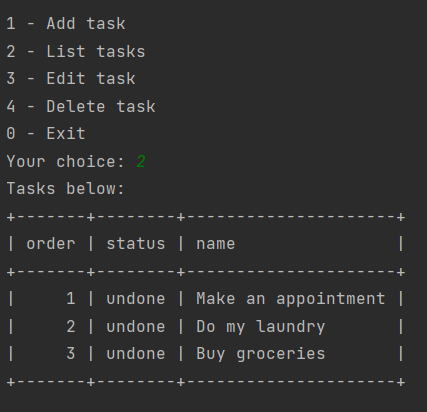
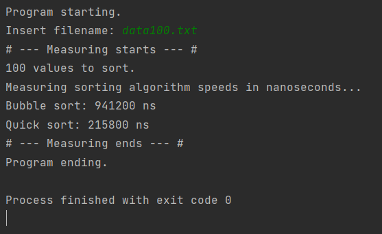
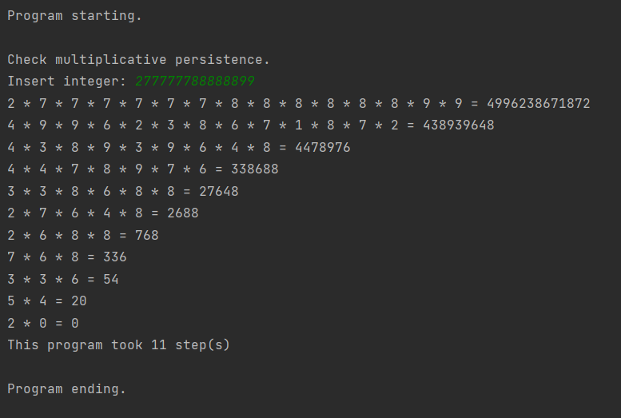

# Python-applications

## Python in-line applications

This is command line applications that I made using Python.

### Status
- In progress, will be more applications in future

---

### TODO App:
- TODO command line app
- Features: Add task, Edit task, List tasks, Remove task.
Screenshots
|                                                             |                                                     |
|-------------------------------------------------------------|-----------------------------------------------------|
|    |    |

---

### Sorting algotithms:
- This application calculates how long it takes to execute algorithms: **Bubble sort** and **Quicksort**
- To test it use "data100.txt" file from project folder
Screenshots:
-  

---

### Multiplicative persistence
- This app counts the multiplicative persistence of a number
- To get more knowledge about it visit: https://en.wikipedia.org/wiki/Persistence_of_a_number
Screenshots:
-  

---

Thank you for visiting

   
